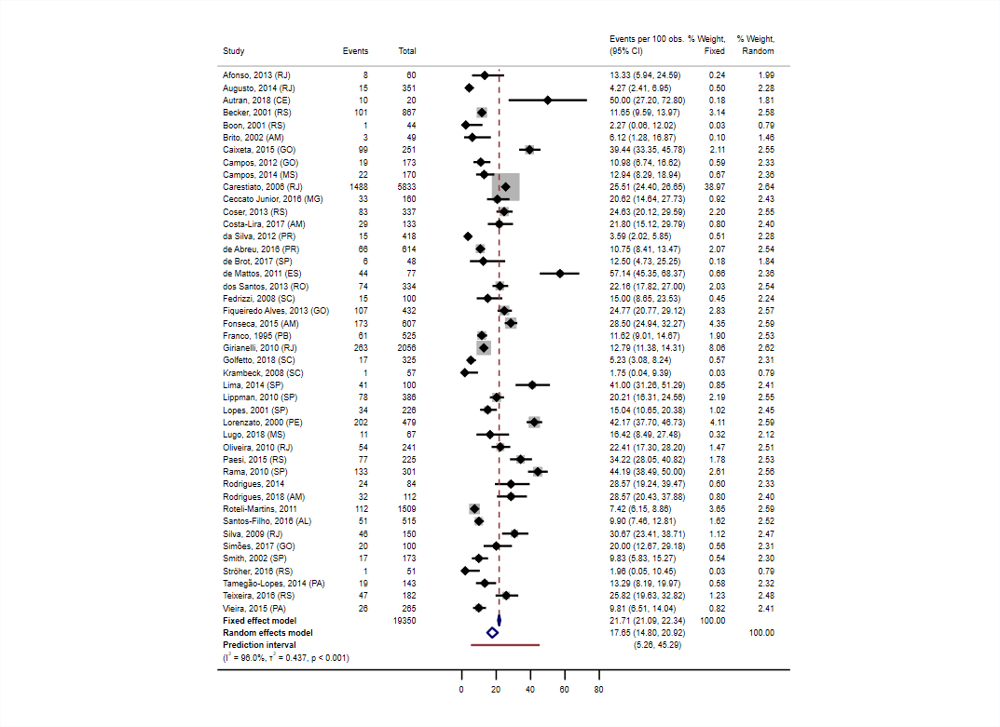

<a href ="https://www.mrcctu.ucl.ac.uk/"></a>

# Example 2
Fixed- and random-effects results displayed simultaneously, with predictive interval.

Data taken from Figure 2 of Colpani V et al. PLoS ONE 2020.  doi:10.1371/journal.pone.0229154  
"Prevalence of human papillomavirus (HPV) in Brazil: A systematic review and meta-analysis"
 
<a href ="https://github.com/UCL/metan/blob/main/Examples"></a>

```Stata
* Example generated by -dataex-. For more info, type help dataex
clear
input str27 Study int(Events Total)
"Afonso, 2013 (RJ)"              8   60
"Augusto, 2014 (RJ)"            15  351
"Autran, 2018 (CE)"             10   20
"Becker, 2001 (RS)"            101  867
"Boon, 2001 (RS)"                1   44
"Brito, 2002 (AM)"               3   49
"Caixeta, 2015 (GO)"            99  251
"Campos, 2012 (GO)"             19  173
"Campos, 2014 (MS)"             22  170
"Carestiato, 2006 (RJ)"       1488 5833
"Ceccato Junior, 2016 (MG)"     33  160
"Coser, 2013 (RS)"              83  337
"Costa-Lira, 2017 (AM)"         29  133
"da Silva, 2012 (PR)"           15  418
"de Abreu, 2016 (PR)"           66  614
"de Brot, 2017 (SP)"             6   48
"de Mattos, 2011 (ES)"          44   77
"dos Santos, 2013 (RO)"         74  334
"Fedrizzi, 2008 (SC)"           15  100
"Fiqueiredo Alves, 2013 (GO)"  107  432
"Fonseca, 2015 (AM)"           173  607
"Franco, 1995 (PB)"             61  525
"Girianelli, 2010 (RJ)"        263 2056
"Golfetto, 2018 (SC)"           17  325
"Krambeck, 2008 (SC)"            1   57
"Lima, 2014 (SP)"               41  100
"Lippman, 2010 (SP)"            78  386
"Lopes, 2001 (SP)"              34  226
"Lorenzato, 2000 (PE)"         202  479
"Lugo, 2018 (MS)"               11   67
"Oliveira, 2010 (RJ)"           54  241
"Paesi, 2015 (RS)"              77  225
"Rama, 2010 (SP)"              133  301
"Rodrigues, 2014"               24   84
"Rodrigues, 2018 (AM)"          32  112
"Roteli-Martins, 2011"         112 1509
"Santos-Filho, 2016 (AL)"       51  515
"Silva, 2009 (RJ)"              46  150
"Simões, 2017 (GO)"            20  100
"Smith, 2002 (SP)"              17  173
"Ströher, 2016 (RS)"            1   51
"Tamegão-Lopes, 2014 (PA)"     19  143
"Teixeira, 2016 (RS)"           47  182
"Vieira, 2015 (PA)"             26  265
end

label variable Events Events 
label variable Total Total

metan Events Total, study(Study) proportion transform(logit) denom(100) ci(exact) ///
	model(iv, label("Fixed") \ dl, label("Random")) allweights /* print weights from both models */ ///
	rfdist         /* prediction interval*/ ///
	lcols(Events Total) /* save the Events and Total columns within the new dataset */ ///
	hetinfo(isq tausq Q pvalue) /*isqparam*/ ///
	forestplot(effect("Events per 100 obs.") ///
	rfopts(sepline lcolor(maroon)) /* Change the rendering of the prediction interval line*/ ///
	xlabel(0(20)80) range(-20 80) astext(70) boxsca(50) /* x-axis labelling and general aesthetic options */ ///
	nolcolscheck nonote graphregion(color(white)))

metan Events Total, study(Study) proportion transform(logit) denom(100) ci(exact) ///
	model(iv, label("Fixed") \ dl, label("Random")) allweights /* print weights from both models */ ///
	rfdist         /* prediction interval*/ ///
	lcols(Events Total) /* save the Events and Total columns within the new dataset */ ///
	hetinfo(isq tausq Q pvalue) /*isqparam*/ ///
	clear nograph
	
local oldfmt : format _LABELS
split _LABELS, parse("(")
replace _LABELS = trim(_LABELS1) if _USE==5 & !missing(_WT_Random)
rename _LABELS2 _LABELS0
split _LABELS0, parse(")")
drop _LABELS0 _LABELS1
split _LABELS, parse(",")
gen obs = _n
summ obs if _USE==5 & !missing(_WT_Random)
replace _LABELS = _LABELS1 + ", " + _LABELS01[`r(min)'] + "," + _LABELS3 if _USE==4
drop _LABELS? _LABELS?? obs
format `oldfmt' _LABELS

forestplot, useopts effect("Events per 100 obs.") ///
  rfopts(sepline lcolor(maroon)) /* Change the rendering of the prediction interval line*/ ///
  xlabel(0(20)80) range(-20 80) astext(70) boxsca(50) /* x-axis labelling and general aesthetic options */ ///
  nolcolscheck nonote graphregion(color(white))
```

