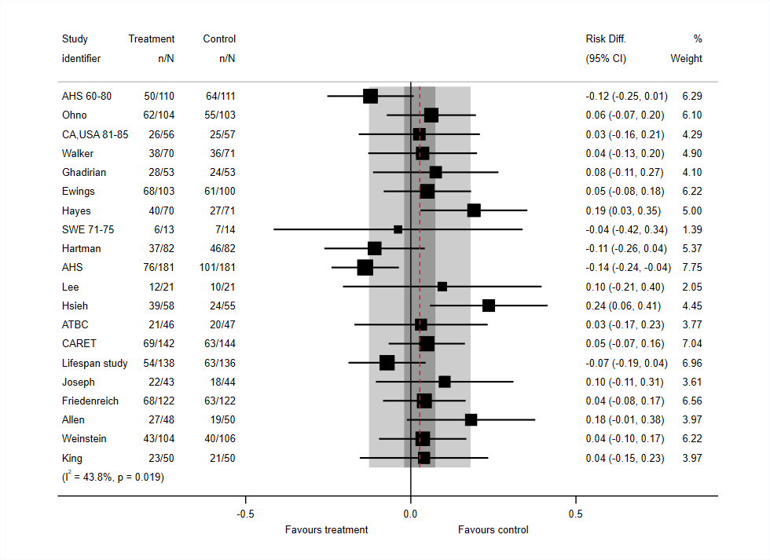

<a href ="https://www.mrcctu.ucl.ac.uk/"></a>

# Example 4
Confidence and predictive intervals represented by overlaid shading

Simulated example dataset by Ross Harris, 2006

<a href ="https://github.com/UCL/metan/blob/main/Examples"></a>

```Stata
use http://fmwww.bc.edu/repec/bocode/m/metan_example_data, clear
metan tdeath tnodeath cdeath cnodeath, rd random rfdist lcols(id) counts ///
	forestplot(ocilineopts(color(gs8) hide) rfcilineopts(color(gs12)) graphregion(color(white)) classic ///
	xlabel(, format("%03.1f")) favours(Favours treatment # Favours control))
```

