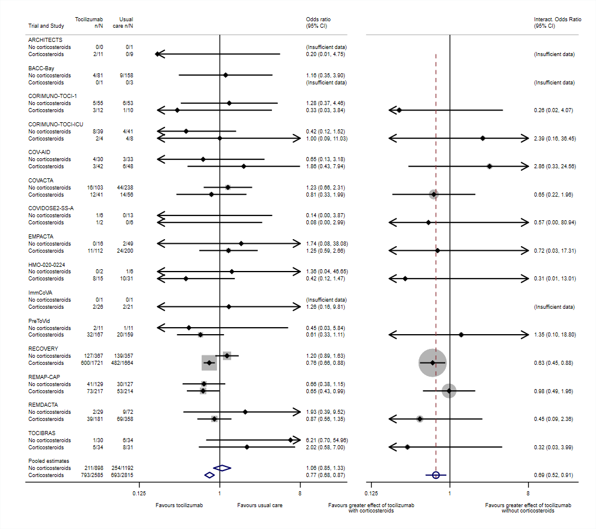

<a href ="https://www.mrcctu.ucl.ac.uk/"></a>

# Example 5
A "two-panel" subgroup and interaction forest plot, as proposed by [Godolphin et al. RSM 2023](https://doi.org/10.1002/jrsm.1590).

Data taken from Supplementary Appendix 2, and displayed in Figure 1, of Godolphin et al RSM 2023 (as above)
"Estimating interactions and subgroup-specific treatment effects in meta-analysis without aggregation bias: A within-trial framework".
Note that this data are better analysed using the separate package `metafloat`, [available from GitHub here](https://github.com/UCL/metafloat), which implements the methods described in that paper and requires much less code than that given here.

Data originally presented in Supplement 2, page 14, of (Shankar-Hari et al. JAMA 2021)[https://doi.org/10.1001/jama.2021.11330].

<a href ="https://github.com/UCL/metan/blob/main/Examples"></a>

```Stata
* Example generated by -dataex-. For more info, type help dataex
clear
input str17 TrialName byte Subgroup int(n0 e0 n1 e1)
"ARCHITECTS"        0    0   0    1   0
"ARCHITECTS"        1   11   2    9   0
"BACC-Bay"          0   81   4  158   9
"BACC-Bay"          1    1   0    3   0
"CORIMUNO-TOCI-1"   0   55   5   53   6
"CORIMUNO-TOCI-1"   1   12   3   10   1
"CORIMUNO-TOCI-ICU" 0   39   8   41   4
"CORIMUNO-TOCI-ICU" 1    4   2    8   4
"COV-AID"           0   30   4   33   3
"COV-AID"           1   42   3   48   6
"COVACTA"           0  103  16  238  44
"COVACTA"           1   41  12   56  14
"COVIDOSE2-SS-A"    0    6   1   13   0
"COVIDOSE2-SS-A"    1    2   1    6   0
"EMPACTA"           0   16   0   49   2
"EMPACTA"           1  112  11  200  24
"HMO-020-0224"      0    2   0    6   1
"HMO-020-0224"      1   15   8   31  10
"ImmCoVA"           0    1   0    1   0
"ImmCoVA"           1   26   2   21   2
"PreToVid"          0   11   2   11   1
"PreToVid"          1  167  32  159  20
"RECOVERY"          0  367 127  357 139
"RECOVERY"          1 1721 600 1664 482
"REMAP-CAP"         0  129  41  127  30
"REMAP-CAP"         1  217  73  214  53
"REMDACTA"          0   29   2   72   9
"REMDACTA"          1  181  39  358  69
"TOCIBRAS"          0   30   1   34   6
"TOCIBRAS"          1   34   5   31   8
end

label define Subgroup_ 0 "No corticosteroids" 1 "Corticosteroids"
label values Subgroup Subgroup_ 

* Create observation(s) for missing subgroup(s)
fillin Trial Subgroup
replace e0 = 0 if _fillin
replace e1 = 0 if _fillin  
replace n0 = 0 if _fillin
replace n1 = 0 if _fillin

generate long f1 = n1 - e1
generate long f0 = n0 - e0

preserve
	metan e1 f1 e0 f0, or iv prefix(_y) study(Trial) by(Subgroup) clear nogr nooverall nohet nomodellabels summaryonly counts
	replace _y_USE = 0 if _y_USE==6
	replace _y_LABELS = "Pooled estimates" if _y_USE==0
	replace _y_USE = 5 if _y_USE==3
	sort _y_USE _y_BY
	replace _y_STUDY = _y_BY
	replace _y_BY = .
	tempfile summary
	save `summary'
restore

* Use the -clear- option to create the "results set" for the left-hand sub-plot
* Notice that in order to group by trial first and carer subgroup second,
*   we need to use options by() and study() in the reverse of their usual roles.
* (Also note the use of prefix "_y", for later differentiation between subgroup effects and interactions)
metan e1 f1 e0 f0, or iv prefix(_y) by(Trial) study(Subgroup) nosubgroup nooverall nohet clear counts group1(Tocilizumab) group2(Usual care) nogr keeporder
append using `summary'

* Create variable "_yInt_STUDY" for later merging with the interaction dataset
* Set this variable to value -1 for the reference subgroup, so that interaction estimates are merged
*   (and hence, line up) with the non-reference subgroup
clonevar _yInt_STUDY = _y_BY if _y_STUDY==1
replace _yInt_STUDY = -1 if missing(_yInt_STUDY) & _y_USE!=5

* Use -ipdmetan- combined with -vwls- to create the "results set" for the right-hand sub-plot
* (-vwls- estimates the difference between categories assuming no residual error)
tempfile interaction
ipdmetan, saving(`interaction', replace) prefix(_yInt) study(_y_BY) nogr nohet keeporder : vwls _y_ES _y_STUDY, sd(_y_seES)

* Merge the datasets together, tidy up, and re-sort
merge m:1 _yInt_STUDY using `interaction'
gen byte touse = _y_USE
replace touse = 1 if inlist(_y_USE, 1, 2)
replace _yInt_USE = 6 if missing(_yInt_USE)
replace _yInt_USE = 6 if _yInt_USE==5 & _y_STUDY==0
isid _y_BY touse _y_STUDY, sort miss

* Finally, we create the left-hand plot...
forestplot, prefix(_y) or nowt lcols(_y_counts0 _y_counts1) keepall ///
	favours("Favours tocilizumab" " " # "Favours usual care" " ") olineopt(lwidth(none)) ///
	xlabel(.125 "0.125" 1 8) range(.125 8) cirange(.2 8) boxsca(50) texts(150) astext(50) savedims(A) graphregion(color(white)) name(left)

* ...and the right-hand plot...
forestplot, prefix(_yInt) interaction usedims(A) nonames eform effect("Interact. Odds Ratio") keepall nowt ///
	favours("Favours greater effect of tocilizumab" "with corticosteroids" ///
	# "Favours greater effect of tocilizumab" "without corticosteroids", fp(8)) ///
	xlabel(.125 "0.125" 1 8) range(.125 8) cirange(.2 8) texts(150) graphregion(color(white)) name(right)

* ...and place the sub-plots side-by-side.
graph combine left right, imargin(zero) xsize(4.5) graphregion(color(white))
```
