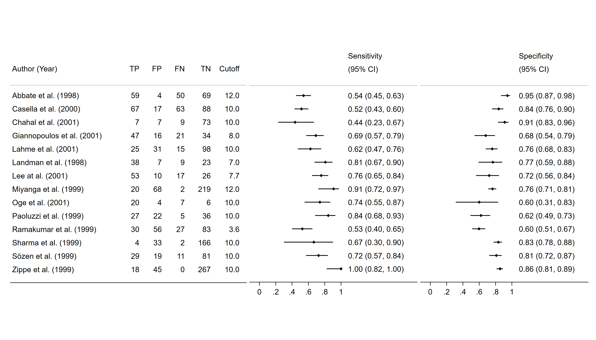

<a href ="https://www.mrcctu.ucl.ac.uk/"></a>

# Example 5
A "compound" forest plot, in which study names and associated information are displayed separately, avoiding repetition whilst allowing the forest plots themselves to have similar dimensions.

Data taken from Figure 3 of [Leeflang MMG et al. Ann Intern Med 2008](https://doi.org/10.7326/0003-4819-149-12-200812160-00008) "Systematic Reviews of Diagnostic Test Accuracy"

<a href ="https://github.com/UCL/metan/blob/main/Examples"></a>

```Stata
* Example generated by -dataex-. For more info, type help dataex
clear
input str19 Author int Year byte(TP FP FN) int TN float Cutoff
"Abbate et al."       1998 59  4 50  69  12
"Casella et al."      2000 67 17 63  88  10
"Chahal et al."       2001  7  7  9  73  10
"Giannopoulos et al." 2001 47 16 21  34   8
"Lahme et al."        2001 25 31 15  98  10
"Landman et al."      1998 38  7  9  23   7
"Lee at al."          2001 53 10 17  26 7.7
"Miyanga et al."      1999 20 68  2 219  12
"Oge et al."          2001 20  4  7   6  10
"Paoluzzi et al."     1999 27 22  5  36  10
"Ramakumar et al."    1999 30 56 27  83 3.6
"Sharma et al."       1999  4 33  2 166  10
"Sözen et al."        1999 29 19 11  81  10
"Zippe et al."        1999 18 45  0 267  10
end

label variable TP TP
label variable FP FP
label variable FN FN
label variable TN TN
format %2.0f TP FP FN TN
format %3.1f Cutoff

// Create variables containing the denominators of sensitivity and specificity:
gen int SensDenom = TP + FN
gen int SpecDenom = TN + FP

// Generate forest plots of sensitivity and specificity, using the proportion option.
// Note the nonames option to suppress the study names here; and the use of the savedims() and usedims() options:
metan TP SensDenom, proportion effect(Sensitivity) nooverall
	forestplot(xlabel(0(.2)1) nobox nonote nonames nowt graphregion(color(white)) scheme(s2color) savedims(A) name(SensPlot))
metan TN SpecDenom, proportion effect(Specificity) nooverall
	forestplot(xlabel(0(.2)1) nobox nonote nonames nowt graphregion(color(white)) scheme(s2color) usedims(A) name(SpecPlot))

// Before creating the left-hand plot containing the study names and associated information, we need to consider the space taken up by column headings.
// In the above forest plots, headings will spill over two lines, so we force one of the variables in the left-hand plot to also spill over two lines:
label variable Cutoff `"`" "' `"Cutoff"'"'

// Now we can create the plot, using colsonly and usedims():
metan TN SpecDenom, proportion effect(Specificity) nooverall label(namevar=Author, yearvar=Year) lcols(TP FP FN TN Cutoff)
	forestplot(xlabel(0(.2)1) nobox nonote nostats nowt colsonly graphregion(color(white)) scheme(s2color) usedims(A) name(NamesPlot))

// Finally, we combine the plots:
graph combine NamesPlot SensPlot SpecPlot, rows(1) imargin(zero) xsize(7) graphregion(color(white)) scheme(s2color)
```
